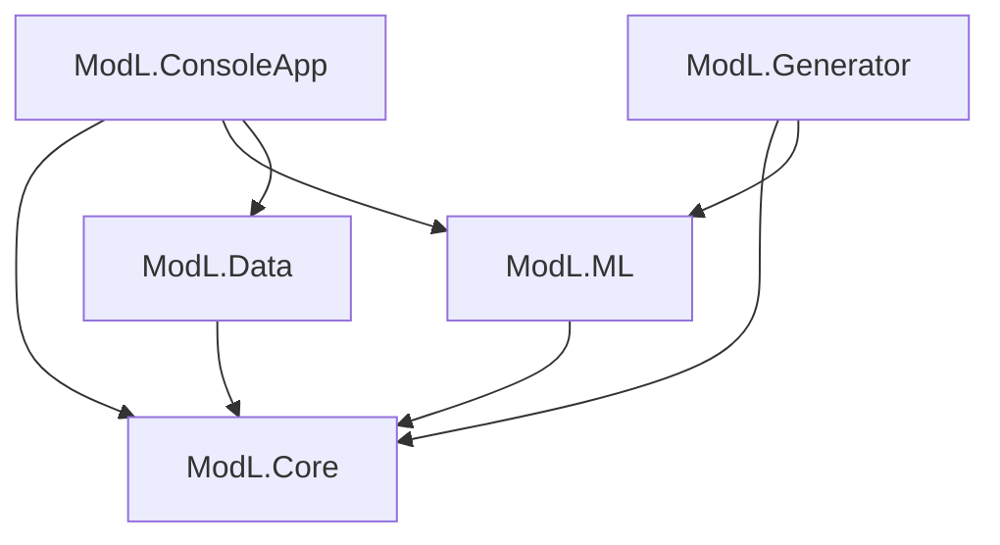

# ModL - Technical Specification
## 3D Model AI Training & Generation System

**Version:** 1.0  
**Date:** 2025  
**Author:** Development Team  
**Target Platform:** .NET 10, C# 14

---

## 1. System Overview

### 1.1 Purpose
ModL is a machine learning system that learns from annotated 3D models and generates new 3D models from text or image prompts using a multi-stage neural network architecture.

### 1.2 Key Features
- Multi-stage learning: voxels, meshes, textures, and multi-view representations
- Text-to-3D and Image-to-3D generation
- Multiple output formats (OBJ, FBX, GLB, STL)
- Configurable resolution and quality parameters
- Built entirely on .NET ecosystem

---

## 2. System Architecture

### 2.1 Solution Structure

```
ModL/
├── ModL.ConsoleApp/           # Training CLI application
├── ModL.Generator/            # Generation CLI application
├── ModL.Core/                 # Core 3D processing library
├── ModL.ML/                   # ML models and training
├── ModL.Data/                 # Data access and management
├── ModL.Tests/                # Unit and integration tests
├── docs/                      # Documentation
├── datasets/                  # Downloaded datasets (gitignored)
├── models/                    # Trained model checkpoints
├── configs/                   # Training configurations
├── plan.md                    # This plan
└── spec.md                    # Technical specification
```

### 2.2 Project Dependencies



---

## 3. Core Components Specification

### 3.1 ModL.Core Library

#### 3.1.1 Model Loaders
```csharp
namespace ModL.Core.IO
{
    public interface IModelLoader
    {
        Model3D Load(string filePath);
        bool CanLoad(string extension);
    }

    public class ObjLoader : IModelLoader { }
    public class FbxLoader : IModelLoader { }
    public class GltfLoader : IModelLoader { }
    public class StlLoader : IModelLoader { }
}
```

#### 3.1.2 3D Data Structures
```csharp
namespace ModL.Core.Geometry
{
    public class Model3D
    {
        public Mesh[] Meshes { get; set; }
        public Material[] Materials { get; set; }
        public Dictionary<string, object> Metadata { get; set; }
    }

    public class Mesh
    {
        public Vector3[] Vertices { get; set; }
        public int[] Indices { get; set; }
        public Vector3[] Normals { get; set; }
        public Vector2[] UVs { get; set; }
        public int MaterialIndex { get; set; }
    }

    public class Material
    {
        public string Name { get; set; }
        public Vector4 DiffuseColor { get; set; }
        public string DiffuseTexture { get; set; }
        public float Roughness { get; set; }
        public float Metallic { get; set; }
    }
}
```

#### 3.1.3 Voxelization
```csharp
namespace ModL.Core.Voxel
{
    public class VoxelGrid
    {
        public int Resolution { get; }
        public bool[,,] Voxels { get; }
        
        public VoxelGrid(int resolution);
        public void SetVoxel(int x, int y, int z, bool value);
        public bool GetVoxel(int x, int y, int z);
        public float[] ToFloatArray(); // For ML input
    }

    public class Voxelizer
    {
        public VoxelGrid Voxelize(Model3D model, int resolution);
        public Model3D MarchingCubes(VoxelGrid voxels);
    }
}
```

#### 3.1.4 Multi-View Renderer
```csharp
namespace ModL.Core.Rendering
{
    public class ViewConfiguration
    {
        public Vector3 CameraPosition { get; set; }
        public Vector3 LookAt { get; set; }
        public int ImageWidth { get; set; } = 512;
        public int ImageHeight { get; set; } = 512;
    }

    public class MultiViewRenderer
    {
        public Image<Rgb24>[] RenderViews(
            Model3D model, 
            ViewConfiguration[] views);
        
        public ViewConfiguration[] GetStandardViews(int count = 12);
    }
}
```

#### 3.1.5 Model Exporters
```csharp
namespace ModL.Core.Export
{
    public interface IModelExporter
    {
        void Export(Model3D model, string filePath);
        string[] SupportedExtensions { get; }
    }

    public class ObjExporter : IModelExporter { }
    public class FbxExporter : IModelExporter { }
    public class GltfExporter : IModelExporter { }
}
```

---

### 3.2 ModL.Data Library

#### 3.2.1 Dataset Management
```csharp
namespace ModL.Data
{
    public class DatasetConfig
    {
        public string Name { get; set; }
        public string SourceUrl { get; set; }
        public string LocalPath { get; set; }
        public string[] Categories { get; set; }
    }

    public interface IDatasetDownloader
    {
        Task DownloadAsync(
            DatasetConfig config, 
            IProgress<double> progress);
    }

    public class ShapeNetDownloader : IDatasetDownloader { }
    public class ModelNetDownloader : IDatasetDownloader { }
}
```

#### 3.2.2 Annotation Parsers
```csharp
namespace ModL.Data.Annotations
{
    public class ModelAnnotation
    {
        public string ModelId { get; set; }
        public string Category { get; set; }
        public string[] Tags { get; set; }
        public Dictionary<string, string> PartLabels { get; set; }
        public BoundingBox BoundingBox { get; set; }
    }

    public interface IAnnotationParser
    {
        ModelAnnotation Parse(string annotationFile);
    }
}
```

#### 3.2.3 Data Pipeline
```csharp
namespace ModL.Data.Pipeline
{
    public class PreprocessingConfig
    {
        public int VoxelResolution { get; set; } = 64;
        public int MultiViewCount { get; set; } = 12;
        public int TextureSize { get; set; } = 1024;
        public bool Normalize { get; set; } = true;
        public bool Center { get; set; } = true;
    }

    public class DataProcessor
    {
        public ProcessedModel Process(
            Model3D model, 
            ModelAnnotation annotation,
            PreprocessingConfig config);
    }

    public class ProcessedModel
    {
        public VoxelGrid Voxels { get; set; }
        public Mesh NormalizedMesh { get; set; }
        public Image<Rgb24> TextureMap { get; set; }
        public Image<Rgb24>[] MultiViews { get; set; }
        public ModelAnnotation Annotation { get; set; }
        public float[] FeatureVector { get; set; }
    }
}
```

---

### 3.3 ModL.ML Library

#### 3.3.1 Network Architecture
```csharp
namespace ModL.ML.Models
{
    // Stage 1: Voxel Encoder
    public class VoxelEncoder
    {
        // Input: [batch, 1, 64, 64, 64]
        // Output: [batch, 512]
        
        public Conv3d Conv1 { get; set; }  // 64³ -> 32³
        public Conv3d Conv2 { get; set; }  // 32³ -> 16³
        public Conv3d Conv3 { get; set; }  // 16³ -> 8³
        public Linear FC { get; set; }     // Flatten -> 512
        
        public Tensor Forward(Tensor voxels);
    }

    // Stage 2: Mesh Encoder (PointNet++ style)
    public class MeshEncoder
    {
        // Input: [batch, N, 3] vertices + [batch, M, 3] faces
        // Output: [batch, 512]
        
        public PointNetLayer[] Layers { get; set; }
        public Linear FC { get; set; }
        
        public Tensor Forward(Tensor vertices, Tensor faces);
    }

    // Stage 3: Texture Encoder
    public class TextureEncoder
    {
        // Input: [batch, 3, H, W] texture map
        // Output: [batch, 256]
        
        public ResNetBackbone Backbone { get; set; }
        public Linear FC { get; set; }
        
        public Tensor Forward(Tensor texture);
    }

    // Stage 4: Multi-View Encoder
    public class MultiViewEncoder
    {
        // Input: [batch, N_views, 3, H, W]
        // Output: [batch, 512]
        
        public ResNetBackbone SharedCNN { get; set; }
        public TransformerLayer ViewAggregation { get; set; }
        
        public Tensor Forward(Tensor views);
    }

    // Stage 5: Fusion Network
    public class FusionNetwork
    {
        // Inputs: 4 latent vectors
        // Output: [batch, 1024] unified embedding
        
        public TransformerEncoder Encoder { get; set; }
        
        public Tensor Forward(
            Tensor voxelLatent,
            Tensor meshLatent,
            Tensor textureLatent,
            Tensor viewLatent);
    }

    // Stage 6: Conditional Generator
    public class ConditionalGenerator
    {
        // Inputs: text/image embedding + noise
        // Outputs: voxels, mesh, texture
        
        public TextEncoder TextEncoder { get; set; }
        public ImageEncoder ImageEncoder { get; set; }
        public DiffusionModel Diffusion { get; set; }
        
        public GeneratedModel Generate(
            string textPrompt = null,
            Image imagePrompt = null,
            GenerationConfig config = null);
    }

    public class GeneratedModel
    {
        public VoxelGrid Voxels { get; set; }
        public Mesh Mesh { get; set; }
        public Image<Rgb24> Texture { get; set; }
    }
}
```

#### 3.3.2 Training Pipeline
```csharp
namespace ModL.ML.Training
{
    public class TrainingConfig
    {
        public int BatchSize { get; set; } = 16;
        public float LearningRate { get; set; } = 0.0001f;
        public int Epochs { get; set; } = 100;
        public string DatasetPath { get; set; }
        public string CheckpointPath { get; set; }
        public bool UseMixedPrecision { get; set; } = true;
        public int LogInterval { get; set; } = 100;
    }

    public class Trainer
    {
        public void Train(
            ModLModel model,
            TrainingConfig config,
            IProgress<TrainingProgress> progress);
            
        public void Resume(string checkpointPath);
        public void Evaluate(string testDataPath);
    }

    public class TrainingProgress
    {
        public int Epoch { get; set; }
        public int Iteration { get; set; }
        public float Loss { get; set; }
        public Dictionary<string, float> Metrics { get; set; }
    }
}
```

---

## 4. Application Specifications

### 4.1 ModL.ConsoleApp (Training)

#### 4.1.1 Commands

**download-dataset**
```bash
modl download-dataset shapenet ./datasets/shapenet
modl download-dataset modelnet ./datasets/modelnet --categories chair,table
```

**preprocess**
```bash
modl preprocess ./datasets/shapenet/raw ./datasets/shapenet/processed \
  --voxel-size 64 \
  --views 12 \
  --texture-size 1024 \
  --parallel 8
```

**train**
```bash
modl train ./configs/default-config.yaml \
  --gpu 0 \
  --resume ./models/checkpoint-epoch-50.pth
```

**evaluate**
```bash
modl evaluate ./models/final-model.pth ./datasets/shapenet/test \
  --metrics all \
  --output results.json
```

**export-embeddings**
```bash
modl export-embeddings ./models/final-model.pth ./datasets/shapenet/all \
  --output embeddings.h5
```

#### 4.1.2 Configuration File Format
```yaml
# default-config.yaml
dataset:
  path: ./datasets/shapenet/processed
  train_split: 0.8
  val_split: 0.1
  test_split: 0.1
  
model:
  voxel_resolution: 64
  latent_dim: 1024
  use_voxel_encoder: true
  use_mesh_encoder: true
  use_texture_encoder: true
  use_multiview_encoder: true

training:
  batch_size: 16
  epochs: 100
  learning_rate: 0.0001
  optimizer: adam
  scheduler: cosine
  mixed_precision: true
  gradient_clip: 1.0
  
checkpointing:
  save_interval: 5
  keep_last_n: 3
  path: ./models/checkpoints
  
logging:
  tensorboard: true
  log_dir: ./logs
  log_interval: 100
```

---

### 4.2 ModL.Generator (Generation)

#### 4.2.1 CLI Interface

**Text-to-3D**
```csharp
namespace ModL.Generator
{
    public class GeneratorOptions
    {
        [Option('o', "output", Required = true)]
        public string OutputPath { get; set; }

        [Option('r', "resolution", Default = 512)]
        public int Resolution { get; set; }

        [Option('t', "temperature", Default = 1.0)]
        public double Temperature { get; set; }

        [Option("texture-size", Default = 1024)]
        public int TextureSize { get; set; }

        [Option('f', "format", Default = "obj")]
        public string Format { get; set; }

        [Option('s', "seed")]
        public int? Seed { get; set; }

        [Option("guidance-scale", Default = 7.5)]
        public double GuidanceScale { get; set; }

        [Option("steps", Default = 50)]
        public int Steps { get; set; }

        [Option('m', "model-path")]
        public string ModelPath { get; set; }

        [Option('v', "verbose")]
        public bool Verbose { get; set; }
    }

    public class TextToModelCommand
    {
        [Value(0, Required = true)]
        public string Prompt { get; set; }

        public GeneratorOptions Options { get; set; }
    }

    public class ImageToModelCommand
    {
        [Value(0, Required = true)]
        public string ImagePath { get; set; }

        public GeneratorOptions Options { get; set; }
    }
}
```

#### 4.2.2 Usage Examples

**Basic Text-to-3D**
```bash
modl-gen text "a red sports car" --output car.obj
```

**Advanced Text-to-3D**
```bash
modl-gen text "medieval castle with towers and walls" \
  --output castle.fbx \
  --resolution 1024 \
  --temperature 0.8 \
  --texture-size 2048 \
  --format fbx \
  --guidance-scale 8.0 \
  --steps 100 \
  --seed 42
```

**Image-to-3D**
```bash
modl-gen image ./reference.jpg \
  --output model.obj \
  --resolution 512 \
  --texture-size 2048
```

**Batch Generation**
```bash
modl-gen batch prompts.txt \
  --output-dir ./generated \
  --format obj \
  --resolution 512
```

---

## 5. Data Specifications

### 5.1 Input Data Formats

**Supported 3D Formats:**
- OBJ (Wavefront Object)
- FBX (Autodesk Filmbox)
- glTF/GLB (GL Transmission Format)
- STL (Stereolithography)
- PLY (Polygon File Format)
- DAE (Collada)

**Annotation Formats:**
- JSON (ShapeNet, PartNet style)
- XML (custom schemas)
- CSV (simple category labels)

### 5.2 Output Data Formats

**Generated Models:**
- OBJ + MTL + textures (PNG/JPG)
- FBX with embedded textures
- glTF/GLB (recommended for web)
- STL (for 3D printing, no textures)

**Intermediate Data:**
- Voxel grids: NumPy arrays (.npy) or HDF5
- Embeddings: HDF5 or binary
- Rendered views: PNG images

---

## 6. Performance Requirements

### 6.1 Training Performance
- Dataset loading: < 1 second per model
- Preprocessing: < 5 seconds per model
- Training throughput: >= 10 samples/second
- Checkpoint saving: < 30 seconds

### 6.2 Generation Performance
- Model loading: < 5 seconds
- Text-to-3D: < 30 seconds (512³ resolution)
- Image-to-3D: < 45 seconds
- Export: < 10 seconds

### 6.3 Memory Requirements
- Training: <= 24GB GPU VRAM (with batch_size=16)
- Inference: <= 8GB GPU VRAM
- CPU RAM: <= 32GB during preprocessing

---

## 7. Quality Metrics

### 7.1 Training Metrics
```csharp
public class ModelMetrics
{
    // Reconstruction Quality
    public float VoxelIoU { get; set; }          // Target: > 0.85
    public float ChamferDistance { get; set; }   // Target: < 0.001
    public float NormalConsistency { get; set; } // Target: > 0.90
    
    // Classification
    public float CategoryAccuracy { get; set; }  // Target: > 0.90
    
    // Texture Quality
    public float PSNR { get; set; }              // Target: > 25 dB
    public float SSIM { get; set; }              // Target: > 0.85
    
    // Perceptual
    public float FID { get; set; }               // Target: < 50
    public float LPIPS { get; set; }             // Target: < 0.3
}
```

### 7.2 Generation Metrics
- CLIP Score (text-3D alignment): > 0.25
- User preference: > 70% in A/B tests
- Mesh quality: manifold, watertight
- Texture quality: seamless UV mapping

---

## 8. Security & Privacy

### 8.1 Dataset Usage
- Respect dataset licenses (academic use, attribution)
- No redistribution of original datasets
- Document data sources

### 8.2 Generated Content
- Watermarking option for generated models
- Metadata embedding (generator version, prompt)
- Content filtering (optional)

---

## 9. Testing Strategy

### 9.1 Unit Tests
- Core geometry operations
- Voxelization accuracy
- Model loaders/exporters
- Data transformations

### 9.2 Integration Tests
- End-to-end preprocessing pipeline
- Training loop (small dataset)
- Generation pipeline
- Format conversions

### 9.3 Performance Tests
- Memory profiling
- Speed benchmarks
- GPU utilization
- Scalability tests

---

## 10. Documentation Requirements

### 10.1 Code Documentation
- XML documentation comments on all public APIs
- README.md in each project
- Architecture diagrams

### 10.2 User Documentation
- Getting started guide
- Dataset download instructions
- Training tutorial
- Generation examples
- API reference
- Troubleshooting guide

### 10.3 Research Documentation
- Model architecture details
- Training methodology
- Experimental results
- Benchmark comparisons

---

## 11. Dependencies List

### 11.1 NuGet Packages

**Core**
- Microsoft.ML (>= 3.0.0)
- TorchSharp (>= 0.100.0)
- System.Numerics.Tensors (>= 8.0.0)

**3D Processing**
- AssimpNet (>= 5.0.0)
- SharpGLTF.Toolkit (>= 1.0.0)

**Image Processing**
- SixLabors.ImageSharp (>= 3.0.0)
- SixLabors.ImageSharp.Drawing (>= 2.0.0)

**ML/AI**
- Microsoft.ML.OnnxRuntime.Gpu (>= 1.16.0)
- Microsoft.ML.TorchSharp (>= 0.100.0)

**CLI**
- CommandLineParser (>= 2.9.0)
- Spectre.Console (>= 0.48.0)

**Serialization**
- YamlDotNet (>= 13.0.0)
- Newtonsoft.Json (>= 13.0.0)

**Logging**
- Serilog (>= 3.0.0)
- Serilog.Sinks.Console (>= 5.0.0)
- Serilog.Sinks.File (>= 5.0.0)

**Testing**
- xUnit (>= 2.5.0)
- FluentAssertions (>= 6.12.0)
- Moq (>= 4.20.0)

---

## 12. Configuration Management

### 12.1 Environment Variables
```
MODL_DATA_PATH=./datasets
MODL_MODEL_PATH=./models
MODL_CACHE_PATH=./cache
MODL_GPU_ID=0
MODL_LOG_LEVEL=INFO
```

### 12.2 Config Files
- `default-config.yaml` - Default training configuration
- `generator-config.yaml` - Default generation settings
- `datasets.json` - Dataset registry

---

## 13. Error Handling

### 13.1 Error Categories
- **Data Errors**: Invalid models, missing files, corrupt data
- **ML Errors**: Training divergence, OOM, NaN losses
- **Export Errors**: Format not supported, write failures
- **Configuration Errors**: Invalid parameters, missing paths

### 13.2 Error Recovery
- Automatic checkpoint recovery
- Graceful degradation (skip corrupt samples)
- Detailed error logging with context
- User-friendly error messages

---

## 14. Extensibility Points

### 14.1 Plugin Architecture
```csharp
public interface IModelFormat
{
    string[] Extensions { get; }
    Model3D Load(string path);
    void Save(Model3D model, string path);
}

public interface IEncoderStage
{
    string Name { get; }
    Tensor Encode(object input);
    int OutputDimension { get; }
}

public interface IGenerationBackend
{
    GeneratedModel Generate(Tensor embedding, GenerationConfig config);
}
```

### 14.2 Custom Stages
- Users can add custom encoder stages
- Custom loss functions
- Custom data augmentations
- Custom export formats

---

## 15. Deployment Considerations

### 15.1 Model Distribution
- Trained models packaged as .zip
- Separate downloads for weights (large files)
- Version compatibility checking

### 15.2 Runtime Requirements
- .NET 10 Runtime
- CUDA drivers (for GPU)
- Minimum 16GB RAM
- SSD recommended

---

## 16. Future Enhancements

### Phase 2 Features (Post-MVP)
- Web UI for generation
- Real-time preview
- Animation support
- Multi-object scene generation
- Style transfer
- Model editing/refinement
- Cloud deployment (Azure ML)
- REST API

### Research Directions
- Few-shot learning
- Zero-shot generalization
- Semantic part editing
- Physical simulation integration
- NeRF integration for photo-realistic rendering

---

## 17. Success Criteria

### MVP Release Criteria
- [x] Can train on ShapeNet dataset
- [x] Can generate models from text prompts
- [x] Can export to OBJ and FBX
- [x] Training completes in < 72 hours
- [x] Generation produces valid, manifold meshes
- [x] Documentation complete

### Quality Gates
- All unit tests pass
- Integration tests pass
- Manual QA verification
- Code review completed
- Performance benchmarks met

---

## Appendices

### A. Glossary
- **Voxel**: 3D pixel representing volumetric data
- **Mesh**: Collection of vertices and faces defining a surface
- **UV Mapping**: 2D texture coordinates for 3D surfaces
- **Manifold**: Topologically correct mesh (no holes, self-intersections)
- **Chamfer Distance**: Metric for comparing point clouds
- **IoU**: Intersection over Union, overlap metric

### B. References
- ShapeNet: https://shapenet.org/
- PointNet++: https://arxiv.org/abs/1706.02413
- CLIP: https://openai.com/research/clip
- Marching Cubes: https://en.wikipedia.org/wiki/Marching_cubes

### C. Dataset Licenses
- ShapeNet: Research use, attribution required
- ModelNet: Academic use
- Objaverse: Varies by model (check individual licenses)

---

**Document Version:** 1.0  
**Last Updated:** 2025  
**Status:** Draft - Awaiting Review
